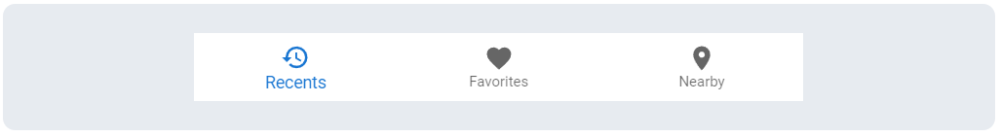
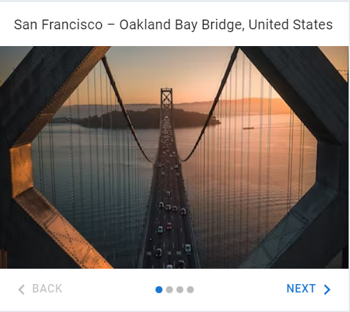
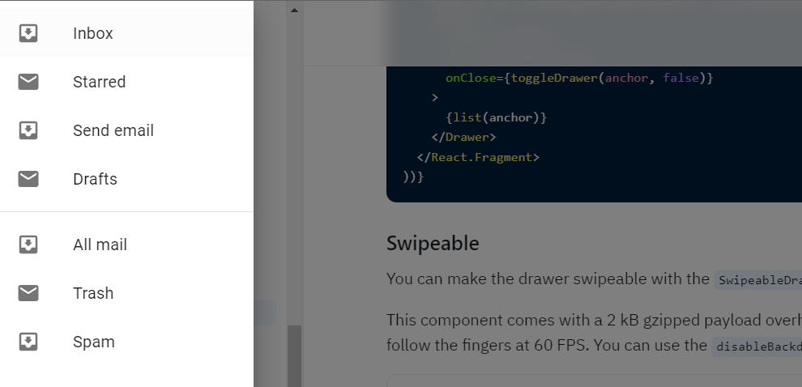
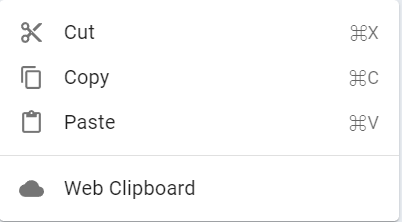

# National Gallery Mobile App

### Getting Started

https://museumrender.onrender.com/

## Contribution

GitHub Manager: [Ernest](https://github.com/ernesttan1976)</br>
In charge with ... </br>
Scrum Master: [Ida](https://github.com/didadeeee)</br>
Utilising [Trello](https://trello.com/invite/b/iE3FX0N4/ATTI2210f3e4c5cad04ab957b63d518ae7e0C5D3A9A5/national-gallery-web) to plan and etc. </br>
Documenter: [May](https://github.com/MayMoeOo95)</br>
In charge with wireframing and etc.</br>
Database Manager: [Mark](https://github.com/Marklimjr)</br>
Designer: K2Z [Kally](), [Kriti]() & [Zhi Qing]() </br>

## Why We Choose React?
Based on this analysis, we can conclude that React is a popular choice due to its high job demand(1), ease of learning(2), component-based architecture(5), virtual DOM(4), reactive updates(8), and state management (Redux)(14). React also offers excellent performance (10), simplicity(11), and optional support for Typescript (12), making it suitable for building complex web applications. Additionally, React's mobile framework, React-Native (13), makes it an excellent choice for building mobile apps. 
<Details>
<Summary> 
read more
</Summary>
However, React does not offer native support for server-side rendering (15), forms(17), routing(16), CSS utilities(18), UI Component Libraries(19), but these functionalities can be added using third-party libraries such as Next.js, Formik, React Router, Tailwind CSS and Material UI, respectively.

Ultimately, the choice of technology depends on the specific requirements of the project, and we should consider factors such as community support, documentation, and compatibility with existing code. Nonetheless, React's popularity and vast ecosystem make it a solid choice for building modern web applications.

| React Features              | React          | Vanilla JS  | EJS Templates | Angular                | Vue             |
| --------------------------- | -------------- | ----------- | ------------- | ---------------------- | --------------- |
| (1) Job Demand              | 57%            | N/A         | N/A           | 31%                    | 11%             |
| (2) Ease of Learning        | ★★★★★          | ★★★★★       | ★★★           | ★★★                    | ★★★★★           |
| (3) Declarative             | Yes            | N/A         | N/A           | Imperative             | Yes             |
| (4) One-way data binding    | ★★★★★          | N/A         | N/A           | 2-way                  | 2-way           |
| (5) Component-Based         | ★★★★★          | N/A         | N/A           | ★★★★★                  | ★★★★            |
| (6) Virtual DOM             | Yes            | N/A         | N/A           | Direct DOM             | Yes             |
| (7) JSX Syntax              | Yes            | N/A         | EJS Syntax    | Template Syntax        | Template Syntax |
| (8) Reactive Updates        | ★★★★★          | N/A         | N/A           | ★★★★                   | ★★★★            |
| (9) Dependency Injection    | ★★★★★          | N/A         | N/A           | ★★★★                   | ★★              |
| (10) Performance            | ★★★★★          | ★★★★        | ★★★           | ★★★★                   | ★★★             |
| (11) Simplicity             | ★★★★★          | ★★★★        | ★★★           | ★★★                    | ★★★★            |
| (12) Typescript             | Optional       | N/A         | N/A           | Tightly integrated     | Optional        |
| (13) Mobile Framework       | (React-Native) | N/A         | N/A           | NativeScript           | Weex            |
| (14) State Management       | (Redux)        | N/A         | N/A           | (NgRx)                 | (Vuex)          |
| (15) Server-Side Rendering  | (Next.js)      | N/A         | ★★★★          | (Angular Universal)    | N/A             |
| (16) Routing                | (React Router) | N/A         | N/A           | (Angular Router)       | (Vue Router)    |
| (17) Forms                  | (Formik)       | N/A         | N/A           | (Angular Forms)        | (Vee-Validate)  |
| (18) CSS Utilities          | (Tailwind CSS) | (Bootstrap) | N/A           | (Angular Material)     | (Vuetify)       |
| (19) UI Component Libraries | (Material UI)  | N/A         | N/A           | (PrimeNG)(Material UI) | (Element UI)    |

Notes:

- The ratings are represented by stars (★), with 5 stars being the highest rating.
- Some of the features are not applicable for certain frameworks (represented as N/A).
- The external libraries are listed in brackets in the column cells.
</Details>


## Wireframe

</br>
</br>
</br>
</br>

## User Stories

- As a non-logged in user, I want to read accessible, consistent information on home screen & exhibition detail screen.
- As a logged in user, I want to leave a comment about the exhibition that I joined at National Gallery Singapore.
- As a visitor, I want to improve my wayfinding and exploration of National Gallery Singapore through the Map feature.
- As an admin, I want to create, update and delete exhibition and artworks information. </br>
  [Product Prototype](https://www.figma.com/proto/WZ6XPMR2mlYvRAr9kvNFpD/P3-Gallery-Explorer-Redesign-v3.0?node-id=1-2&starting-point-node-id=1%3A2&scaling=scale-down)

## ERD Diagram (mermaid.live)

[](https://mermaid.live/edit#pako:eNqFUl1PgzAU_SvkPrNlA8Y23pwSXTI02VyihpcrdEgCLWmLOhn_3fLlFhtjH5qbe057Ts9tBRGLCXhA-E2KCcc8pIZa3b7f-Vuj6upmCclTmhgUc6I1E8aSjKxjDSA5ppnWLVCID8Z1Or6jRN6165B2RaCc7APjdBqNWGXcXm02_vbZ8IxQ2acSUypCGLgD2pP9p7v1av34B3lAe_L1QxD49_-R9URkKjM9kpiIiKeFTBk9Y7TMXwlXzyQcE7JFqZhndDAQsTwnVIpfOQzwhYN2Rj19ddQ85EQIpaPp8wvhn-vBhJxwNa9Y_YhWIwT5RtS0oUkkJgcsM9kEUisqlpLtjjQCT_KSmFAWMUrSfyPwDpgJ1S2QglfBJ3jWwh0704U7nU9t23UcxzbhCN5iPLcdy5pYy4nrzpbOrDbhizF1w7Q9_dLWjUT9DRFCzX8)

## Screenshots

</br>
</br>
</br>
</br>

## Technologies Used

1. React
2. React Material UI
3. Node.js
4. Express Framework
5. MongoDB & Mongoose
6. JavaScript
7. Render deployment
8. Git & GitHub

## Features

### Login, Sign Up (User & Admin)

- `users-service.js`
```js
export async function signUp(userData) {
  const token = await usersAPI.signUp(userData);
  localStorage.setItem("token", token);
  return getUser();
}

export function getUser() {
  const token = getToken();
    return token ? JSON.parse(window.atob(token?.split(".")[1])).user : null;
}

export function getToken() {
    const token = localStorage.getItem("token");
  if (!token) return null;
   const payload = JSON.parse(window.atob(token.split(".")[1]));
    if (payload.exp < Date.now() / 1000) {
       localStorage.removeItem("token");
    return null;
  }
  return token;
}

export function logout() {
  localStorage.removeItem("token");
}
```

The signUp(userData) function is an asynchronous function that takes a userData object as input. It uses the usersAPI module to make a network request by calling the signUp() function and waiting for the response. The response is a JSON Web Token (JWT), which is stored in local storage using the localStorage.setItem() method. The function then calls getUser() to get the user associated with the token and returns the result.

The getUser() function first calls getToken() to obtain the JSON Web Token (JWT), and then uses the token to retrieve the user associated with it. If a token is present, it decodes it and returns the user property of the resulting object. However, if there is no token, it returns null.

The getToken() function retrieves the JSON Web Token (JWT) stored in local storage. If there is no token stored, it returns null. If a token is present, it first decodes it using window.atob() and parses the resulting JSON string to obtain the payload. If the token has expired, as indicated by the exp property in the payload, the function removes the token from local storage and returns null. Otherwise, it returns the token itself.

The logout() function removes the JSON Web Token (JWT) from local storage using the localStorage.removeItem() method.

- `usersController.js`
```js
const create = async (req, res) => {
  const { password } = req.body;
  if (password.length < 5) {
    res.status(400).json({ message: "Password is too Short, Please Try Agian." });
    return;
  }

  try {
    const user = await User.create(req.body);
    const payload = { user };
    const token = jwt.sign(payload, JWT_SECRET, { expiresIn: 60 }); // 1hr
    res.status(201).json(token);
  } catch (error) {
    res.status(500).json(error);
  }
};

const login = async (req, res) => {
  const { email, password } = req.body;
  if (password.length < 5) {
    res.status(400).json({ message: "Incorrect Password" });
    return;
  }
  try {
    const user = await User.findOne({ email });
    if (user === null) {
      res.status(401).json({ message: "No user found, Please sign up." });
      return;
    }
    const match = await bcrypt.compare(password, user.password);
    if (match) {
      const payload = { user };
      const token = jwt.sign(payload, JWT_SECRET, { expiresIn: 60 });
      res.status(200).json({ token });
      console.log("user login successful");
    } else {
      res.status(401).json({ message: "Wrong password" });
    }
  } catch (error) {
    res.status(500).json(error);
  }
};
```

The create() function first checks the length of the password provided in the request body. If it's less than 5 characters, it responds with a 400 Bad Request status code and a JSON object containing an error message. If the password is long enough, the function tries to create a new user in the database using the User.create() method, passing in the request body as the data to be stored. If the user is created successfully, it creates a payload object containing the user and signs it with a JSON Web Token using the jwt.sign() method. The signed token is then returned in the response with a 201 Created status code. If an error occurs during user creation, such as a database error, it responds with a 500 Internal Server Error status code and returns the error as a JSON object.  

The login() function attempts to find a user in the database with the specified email using the User.findOne() method. If the user is not found, it responds with a 401 Unauthorized status code and a JSON object containing a message property with the value "No user found, Please sign up." If a user is found, it compares the password provided in the request body with the user's stored password using the bcrypt.compare() method. If the passwords match, it creates a payload object containing the user and signs it with a JSON Web Token using the jwt.sign() method. The signed token is then returned in the response with a 200 OK status code. If the passwords don't match, it responds with a 401 Unauthorized status code and a JSON object containing a message property with the value "Wrong password." If an error occurs during the login process, such as a database error, it responds with a 500 Internal Server Error status code and returns the error as a JSON object. 

- `App.jsx` 
```js
<Route path="/users/signup" element={<SignUpForm />} />
<Route path="/users/login" element={<LoginForm setUser={setUser} />} />  
<Route path="/users/logout" element={<LogOutMsg />} />
```
React routes, paths to dirrerent component. For example, when a user navigates to "/users/signup" in the application, the <SignUpForm /> component will be rendered.

```js
<Route path="/*" element={<AccessDeniedMsg />}/>
```
If a user navigates to a URL that doesn't match any of the routes defined in the Router component, this AccessDeniedMsg component will be rendered instead. 

```js
insert your favorite react component here
```

```js
insert your favorite react component here
```

### Artwork CRUD

```js
insert your favorite express controller method here
```

```js
insert your favorite react component here
```

### Exhibition CRUD

```js
insert your favorite express controller method here
```

```js
insert your favorite react component here
```

### Map Search

```js
insert your favorite express controller method here
```

```js
insert your favorite react component here
```

### Map Route

```js
insert your favorite express controller method here
```

```js
insert your favorite react component here
```

### Client Side Routing

```js
is it app.jsx code here?
```

## Conclusion

### Biggest Challenge

Ernest: </br>

Ida:

- Material UI CSS Style Default Behaviour
- Learning to work in a group using Github
- Managing expectations
- Communicate each other's code

May:

- Material UI
- Understanding each other's style of code.
- The use of bcrypt and jsonwebtoken.
- Getting the artwork Information to show when user click on the artwork.

</br>
Mark: 
- Initial modelling of Data Models and planning out relationships and dependencies 
- Formulating the logic of a map feature 
- Condensing a route solution into a single object that holds various fields of information, eg img,directions,features,icons

</br>

### Key Learnings

shall we move the react key learnings here?

Ernest: </br>

Ida:

- Group Git
- Learnt debugging skills from fellow members
- Material UI - Difficult at first but very powerful tool
- Utilising wireframing, trello to manage a group project
- Model is CRUCIAL

May:

- The use of Group Git, branches and conflicts during merge.
- Initial planning of the project (wireframes, model schemas, paths and routes), the more detailed the planning, result in a clearer and smoother implementation of the app.
- It is important to aim and focus on completing one specific task at a time.
- React CRUD.
- User Sign up and Login using bcrypt and jsonwebtoken.
- Utilization of ternary operator to enable certain user to accessible to certain informations.

Mark: </br>


## Q & A

## Resources

Product Prototype: <a href="https://www.figma.com/proto/WZ6XPMR2mlYvRAr9kvNFpD/P3-Gallery-Explorer-Redesign-v3.0?node-id=1-2&starting-point-node-id=1%3A2&scaling=scale-down">Figma</a><br />
Wireframe: <a href="https://docs.google.com/presentation/d/1QK74u5tYnI7stAfgfH9_ZuHCs52L_hfNjI2NLIp1Txw/edit?usp=sharing">Google Docs</a><br />
Project Management: <a href="https://trello.com/invite/b/iE3FX0N4/ATTI2210f3e4c5cad04ab957b63d518ae7e0C5D3A9A5/national-gallery-web">Trello</a><br />
Path & Components: <a href="https://docs.google.com/presentation/d/1zn3BJGd09h5cBunKGQARrrkWUGV-Zak4PTxHN-Otd1w/edit?usp=sharing">Google Docs</a><br />
Photos used: <a href="https://pixabay.com/">pixabay</a><br />
Artworks and Exhibitions Reference: <a href="https://www.nationalgallery.sg/">National Gallery Singapore</a>

<!--
## How to Configure MUI Theme?
1. ([Use Theme Generator https://zenoo.github.io/mui-theme-creator/](https://zenoo.github.io/mui-theme-creator/))
2. Set primary and secondary colours.
3. Save the theme object, cut and paste in theme.js.

``` jsx
 import {theme} from './theme.js';
 import { ThemeProvider } from '@emotion/react';
...
...
<ThemeProvider theme={theme}>
        <Router>
          <App />
        </Router>
      </ThemeProvider>
```
## How to adjust margin, padding, etc on each item? (SX PROP)
([Add style to 'sx' prop](https://mui.com/material-ui/customization/how-to-customize/#1-one-off-customization))
 m: 4 -> margin of 4 x 8 = 32px,
  where 8 is the theme.spacing = 8px
 p: 4 -> padding of 4 x 8 = 32px,
  where 8 is the theme.spacing = 8px

 percentages: any number 0 to 1 is considered a percentage
 width: 0.5 -> width: 50%

 whole numbers: units of pixels
 width: 300 -> width: 300px

``` jsx
<Slider
  defaultValue={30}
  sx={{
    width: 300,
    color: 'success.main',
  }}
/>
```

## Material UI Icons
 Browse, copy and paste from here
([Material UI Icons](https://mui.com/material-ui/material-icons/))

## Material UI Components

### 1. Bottom Navigation -> <BottomNavigation /> ([Docs](https://mui.com/material-ui/react-bottom-navigation/))


 Navigation bar stuck to the bottom.

### 2. Stepper (aka Carousel) -> <Stepper/> ([Docs](https://mui.com/material-ui/react-stepper/))


 Plain stepper is having a before and next botton. A stepper linked to an image is a carousel.

### 3. Drawer -> <Drawer /> ([Docs](https://mui.com/material-ui/react-drawer/))


 Side drawer menu

### 4. Menu -> <Menu /> ([Docs](https://mui.com/material-ui/react-menu/))


 Menu is a sub-component for drop downs from the navbar.

### 5. Card ([Docs](https://mui.com/material-ui/react-card/))

 Card is a 'Paper' element with a shadow and with 'title', 'subtitle' attributes.
 A Card contains 'Content', 'Action' elements.
 A Content element consists of 'Typography' and 'Image' elements
 An Action element contains buttons. Possible to add accordion effect.
 Very cool element!

### 6. Grid (aka Flexbox) -> <Grid />([Docs](https://mui.com/material-ui/react-grid2/))

 Don't be fooled by the name 'Grid'. It is actually more like a 'Flex'.
 Parents are tagged with attribute 'container'. Children are tagged with attribute 'item'.
 It uses 12 columns, similar to Bootstrap.

### 7. Snackbar (aka Toast) -> <Snackbar/> ([Docs](https://mui.com/material-ui/react-snackbar/))

 This looks like a notification toast

### 8. Skeleton (aka loading placeholder) -> <Skeleton/> ([Docs](https://mui.com/material-ui/react-skeleton/))

For showing a placeholder while waiting for content to load

### 9. List -> <List /> ([Docs](https://mui.com/material-ui/react-list/))

This element is part of a larger element like a menu or it can be a list of images or messages.

-->
